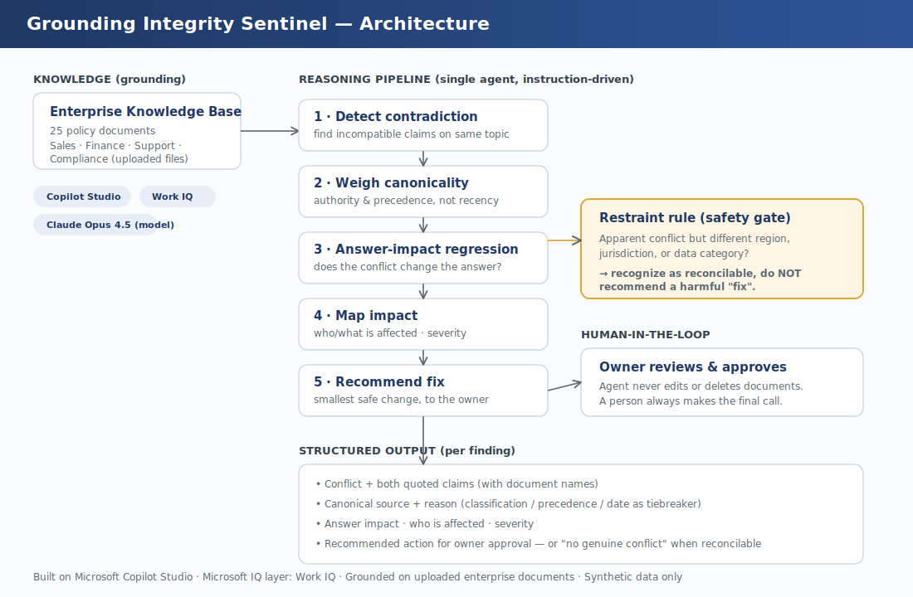

# Grounding Integrity Sentinel

**An enterprise agent that audits a Copilot knowledge base for contradictions that silently corrupt the answers employees rely on — proves they change Copilot's answers, recommends fixes only a human approves, and knows when *not* to "fix" a conflict at all.**

Built for the Microsoft Agents League hackathon · **Track: Enterprise Agents for Microsoft 365 Copilot** · **Microsoft IQ layer: Work IQ**

---

## The problem

Every organization running Microsoft 365 Copilot accumulates documents faster than it curates them. Over time, policies drift into conflict: an old returns policy says 30 days, a newer one says 15; a sales playbook allows a 25% discount, finance caps it at 15%; a global retention rule says 7 years, a GDPR addendum says 30 days. Nobody compares thousands of documents by hand — so these contradictions stay invisible until **Copilot grounds an answer on the wrong one and tells a real employee something wrong.**

This is the failure mode behind a large share of "Copilot gave us a bad answer" complaints. The answer usually isn't Copilot's fault — it's the contradictory documents underneath it.

## What the Sentinel does

The Sentinel audits the knowledge base an agent is grounded on and, for each genuine contradiction, runs a disciplined reasoning chain:

1. **Detect** — find incompatible claims about the same topic across documents.
2. **Weigh canonicality** — decide which source is authoritative by **document type and stated precedence** (a Controlled/contractual document outranks an internal playbook), using recency only as a tiebreaker.
3. **Answer-impact regression** — reason about whether the contradiction actually *changes the answer* a user would get, and what the wrong answer would be.
4. **Map impact** — identify who/what is affected and assign a severity.
5. **Recommend a fix** — propose the smallest safe change, addressed to the owning team, **for human approval**. The agent never edits or deletes anything itself.

## What makes it different

Most "knowledge hygiene" tools flag duplicate or similar documents. The Sentinel is built around three things they don't do:

- **Answer-impact regression.** It doesn't just notice two documents differ — it reasons about whether the difference actually corrupts the answer Copilot would give. A knowledge base can hold hundreds of trivial differences and only a handful that matter; the value is the triage.
- **Authority over recency.** "Use the newest document" is wrong whenever the newest document is a draft, a regional variant, or an internal note that contradicts a signed contract. The Sentinel weighs document authority and explicit precedence statements first, and treats recency as a tiebreaker only.
- **Restraint.** When two documents only *appear* to conflict because they govern different jurisdictions, regions, or data categories, the Sentinel recognizes them as **reconcilable** and refuses to recommend a "fix." Blindly resolving such an apparent conflict could destroy a legally required record or state a compliance violation. An agent that knows when *not* to act is the difference between something an enterprise can trust and something it can't.

## Demonstration

The agent is demonstrated on **Meridian Cloud**, a synthetic company with **25 policy documents** across Sales, Finance, Support, and Compliance. Four contradictions are planted, each a progressively harder type:

| # | Type | Conflict | What it tests |
|---|------|----------|---------------|
| 1 | Recency trap | Support runbook (3 days old) says P1 response = 4h; signed MSA (older) says 1h | Authority must beat recency |
| 2 | Cross-silo | Sales Playbook allows AE discounts to 25%; Finance Deal Desk caps self-approval at 15% | Detect conflict with no shared version lineage |
| 3 | Reconcilable | Global policy keeps records 7 years; GDPR addendum erases EU personal data in 30 days | **Restraint** — recognize this is *not* a true conflict |
| 4 | Structured vs prose | Pricing list says Enterprise $4,000; Pricing FAQ says from $3,500 | Source-of-truth reasoning across formats |

The agent has never been told where the contradictions are. It finds and reasons about them from the documents alone.

## Architecture & stack

- **Platform:** Microsoft Copilot Studio (no-code agent, instruction-driven reasoning)
- **Microsoft IQ:** Work IQ — the Microsoft 365 intelligence layer, enabled on the agent
- **Model:** Claude Opus 4.5 (selected for structured multi-step reasoning)
- **Grounding:** the 25 enterprise documents, uploaded directly as a knowledge source
- **Human-in-the-loop:** every finding is a recommendation for owner approval; the agent makes no changes itself

See `architecture-diagram.png` for the full pipeline, including the restraint safety gate.

## Reproduce this agent

The agent is fully reproducible from this repository — no custom code or paid license required for the build itself:

1. In **Microsoft Copilot Studio**, create a new agent (or use **New agent → Skip to configure**).
2. Set the **name** and **description** (see the project page), and paste the full **instructions** from `build_docs/Agent-Instructions-CopilotStudio.docx` into the Instructions field.
3. In **Knowledge**, choose **Add → Upload**, and upload the 25 documents from `/knowledge_base` (all four department folders) as the grounding source.
4. Set the **model** to a strong reasoning model (this build used **Claude Opus 4.5**).
5. Enable **Work IQ** (the Microsoft IQ integration).
6. Add the three **suggested prompts** (audit for contradictions; check discount authority; check EU data retention).
7. Open the **test pane** and run the questions in `build_docs/Benchmark-Questions.docx` to verify behavior against the answer key.

The actual responses this produced are saved in `sample-outputs.md`.

## Repository contents

| Path | What it is |
|------|-----------|
| `/knowledge_base` | The 25 synthetic Meridian Cloud policy documents (the agent's grounding) |
| `/site` | The same documents as a public web portal (GitHub Pages) |
| `/build_docs/Agent-Instructions-CopilotStudio.docx` | The full agent instructions pasted into Copilot Studio |
| `/build_docs/Benchmark-Questions.docx` | The probe set + answer key used to validate the agent |
| `sample-outputs.md` | Actual responses the agent produced (evidence of real behavior) |
| `architecture-diagram.png` | System architecture |
| `sentinel-icon-512.png` | Agent icon |

## Reliability & safety

- **Synthetic data only.** Meridian Cloud is fictional; no real or proprietary company data is used. This satisfies the hackathon's original-work requirement and avoids any confidentiality risk.
- **Recommend, never act.** The agent detects, reasons, and recommends. A human always approves. No document is changed automatically.
- **Restraint by design.** The agent is explicitly instructed not to recommend deletion or overwriting when an apparent conflict is actually a scoped, reconcilable rule — preventing it from causing the very harm it's meant to detect.

## Honest scope notes

- The "answer-impact regression" is reasoning the agent performs within each response (it articulates how a contradiction would change the answer). An automated benchmark-suite harness that runs the probe set and diffs outputs is a natural next enhancement; the included `Benchmark-Questions.docx` is its seed.
- Work IQ is enabled as the Microsoft IQ integration and provides the M365 intelligence/continuity layer; the agent's document grounding is via directly uploaded files.

---

*Grounding Integrity Sentinel — keeping the ground that Copilot stands on clean.*
